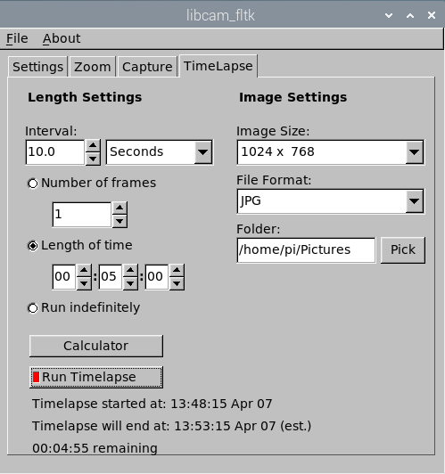

# libcam_fltk

This is a GUI version of [libcamera-apps](https://github.com/raspberrypi/libcamera-apps). It provides visual, interactive access to some of the
functionality of said suite of command line programs. The GUI is implemented using the lightweight framework [FLTK](https://fltk.org).

Releases
--------

Download the latest release from [Releases](https://github.com/fire-eggs/libcam_fltk/releases).

Documentation
-------------

All documentation, including getting started, is in the [Wiki](https://github.com/fire-eggs/libcam_fltk/wiki).

Screenshots
-----------
The following screen captures show the primary features of libcam_fltk. 

The Settings tab, along with the Preview Window:

The Zoom tab, a convenient means to change the "region of interest":

The Capture tab, where image capture takes place:

The Timelapse tab, with a timelapse capture in progress:

The Timelapse Calculator dialog, an assistant for determining the ideal timelapse settings:

License
-------

The source code is made available under the [BSD 3-Clause-Clear license](https://spdx.org/licenses/BSD-3-Clause-Clear.html).

